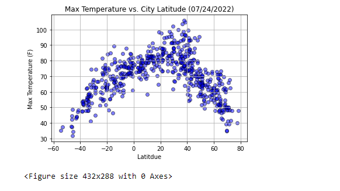
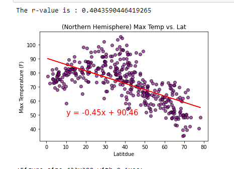
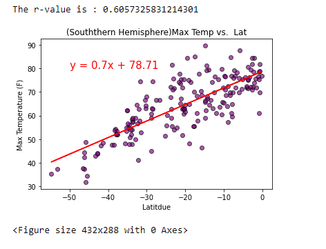
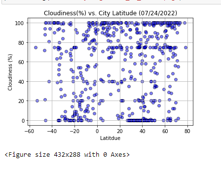
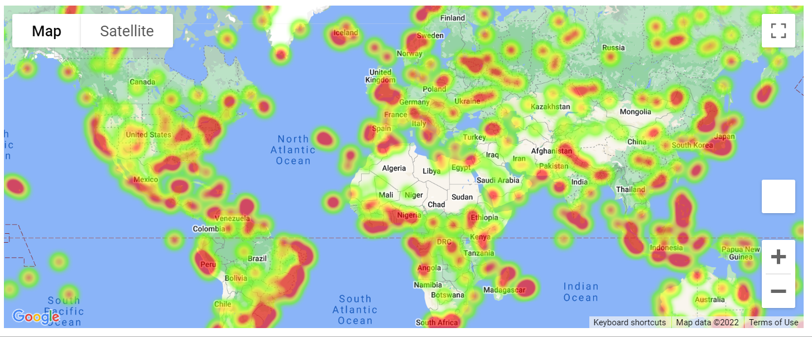
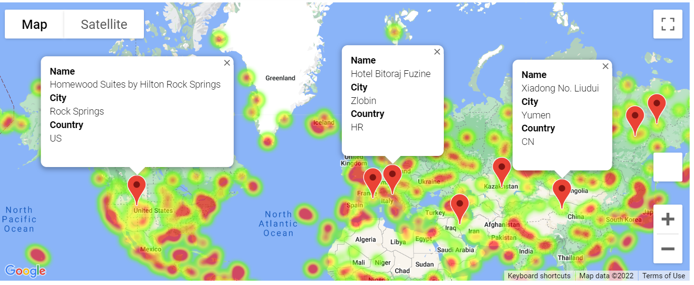

# Python-API-Challenge

What is an API?

API is the acronym for Application Programming Interface. It is a software intermediary that allows two applications to talk to each other. Each time one uses an app like Instagram, send an instant message or post a picture, or check their mail on their phone, they’re using an API. Another example is, when we are sitting at a restaurant with a menu to order from. The critical link to communicate our order to the kitchen (which is the sytem and prepares our food) is the waiter or so called as an API. The waiter is the messenger - or the API that takes our order/ request and the kitchen/ system to prepare the order/ what to do. Then the waiter delivers the response back to us; in this case, it is the food.  

This assignment will be a showcase of what we have learned about python requests, pandas, matplotlib, API requests and JSON traversals. The main task of this assignmnet is to prove that the weather gets hotter as we approach the equator as compared to the northern and southern hemispheres. 

## Configuration: 

Inorder to start the assignment we would need to do the following before we begin:  

* Create and clone a new repository for this project to our computer and name is as python-api-challenge. 
* Inside our local repo, make a directory for both challenges and name them as WeatherPy and VacationPy Challenge. 
* Inside these folder, add new files called WeatherPy.ipynb and VacationPy.ipynb. These will be the main scripts to run our analysis.
* Every time we make changes to the directory or files push the above changes to Github.
* We dont want our api_keys.py file to be exposed to public on github, so we add a .gitignore file to our local repo.
* Before we add our files to GitHub, we add api_keys.py to the .gitignore file by opening the python-api-challenge github folder in 
  VS code. Then open the .gitignore file and on the first line, type api_keys.py or config.py, the files where we have the api_keys stored in. 
* Open git bash in the challenge folder, then git add, git commit, and git push to commit the modifications to .gitignore and the WeatherPy.ipynb file to GitHub.
* On GitHub, the only new file we should find is the WeatherPy.ipynb file.

## PART 1 : WeatherPy

### Instructions:

In this part, we need to visualize the weather of 500+ cities of varying distance from the equator. In order to do so, we need to create a python script, use a OpenWeatherMap API library and use what we've learned in class to show the weather across various cities. 

 1) The first requirement is to create a series of scatter plots to showcase the following relationships:

* Temperature (F) vs. Latitude
* Humidity (%) vs. Latitude
* Cloudiness (%) vs. Latitude
* Wind Speed (mph) vs. Latitude

After each plot, we need to add a sentence or two explaining what the code is analyzing.

 2) The second requirement is to compute the linear regression for each relationship. We need to separate the plots into Northern 
    Hemisphere (>= 0 degrees latitude) and Southern Hemisphere (< 0 degrees latitude):   

* Northern Hemisphere - Temperature (F) vs. Latitude
* Southern Hemisphere - Temperature (F) vs. Latitude
* Northern Hemisphere - Humidity (%) vs. Latitude
* Southern Hemisphere - Humidity (%) vs. Latitude
* Northern Hemisphere - Cloudiness (%) vs. Latitude
* Southern Hemisphere - Cloudiness (%) vs. Latitude
* Northern Hemisphere - Wind Speed (mph) vs. Latitude
* Southern Hemisphere - Wind Speed (mph) vs. Latitude

After each pair of plots, we need to explain what the linear regression is modeling. For example, describe any relationships that we notice and any other findings that we  may have.
The final notebook must have the following:  

* Randomly select at least 500 unique (non-repeated) cities based on latitude and longitude.
* Perform a weather check on each of the cities using a series of successive API calls.
* Include a print log of each city as it's being processed, with the city number and city name.
* Save a CSV of all retrieved data and a PNG image for each scatter plot.

## PART 2 : VacationPy

### Instructions:  

For this part of the assignment we need to use Jupyter-gmaps and the Google Places API to plan our future vacations. We would need to run jupyter nbextension enable --py gmaps in gitbash in order for us to display the maps.  

1) The first requirement for this part is to create a heat map that displays the humidity for every city from Part 1. For Example,    

2) The second requirement for this part is to drop any rows that don't satisfy our ideal weather conditions. We would need to narrow down the DataFrame to find our ideal weather condition.  For example:   

* A max temperature lower than 75 degrees but higher than 65.
* Humidity less than 60%
* Cloudiness less than 45%  

3) The last requirement is to use Google Places API to find the first hotel for each city located within 5,000 meters of our coordinates. And plot the hotels on top of the humidity heatmap, with each pin containing the Hotel Name, City, and Country. For example,    

## Conclusion/Analysis:

After plotting all the required data in WeatherPy, I've come up with the following conclusions:

* Looking at the max.temp vs. latitude plot for the random 620 cities selected. Most of the cities fall above the equator. On (07/24/2022) the cities at the equator projected a max temp between 70-80 degrees F. The cities that are 40 degrees north of the equator projected max temps ranging between 55-100 degrees F. The cities that are close to 80 degrees north of the equator projected max temperature between 40-50 degrees F. 

   

* By looking at pair of the Northern and Southern Hemisphere plots for Max Temp Vs. Latidude, we can we can conclude that the northern hemisphere plot of Max Temp vs.Latitude has a negative correlation and a negative slope in our linear regression equation. We can see that as the latitude increases the temperature decreases. Whereas, in the southern hemisphere plot, we can see it has a positive correlation and Linear regression slope. We can predict from the r^2 value that 60% of the variability in temperature can be explained by latitude in the southern hemisphere. In the northern hemisphere only 40% of the variability in temperature can be explained by the change in latitude. As we go closer to the equator from the south pole, we get warmer weather conditions.

  

* From the Cloudiness Vs. City Latitude plot, we can conclude that on 07/24/2022, some of the cities had zero cloudiness, some fell between the ranges of 60-100%. More cities above the equator had a higher percentage of cloudiness as compared to the cities that fell under the equator. The cities below the equator had almost equal percentage of cloudiness, most of the cities that are 20 degrees south had zero cloudiness and most of the cities that are 40 degrees south of the equator had 100% cloudiness.

For the VacationPy, after creating the heatmap and narrowing down the cities that satisfied my ideal weather conditions. 
I would like to vacation at Rock Springs, Wyoming USA. 

Here are the screenshots of my results:

   

